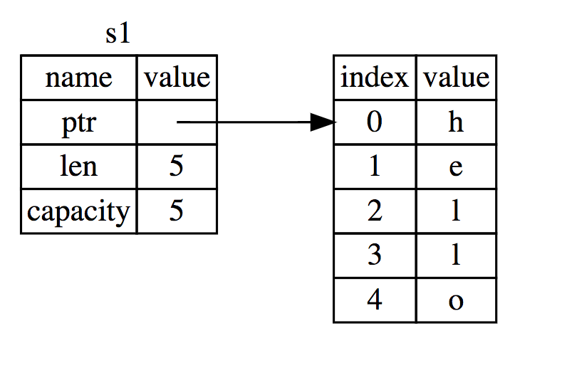
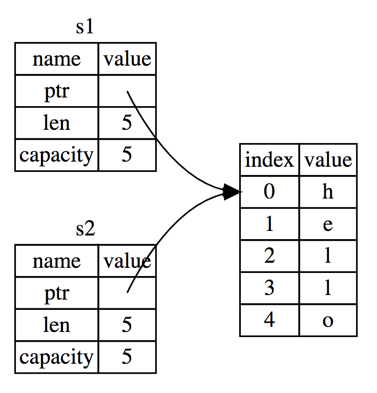
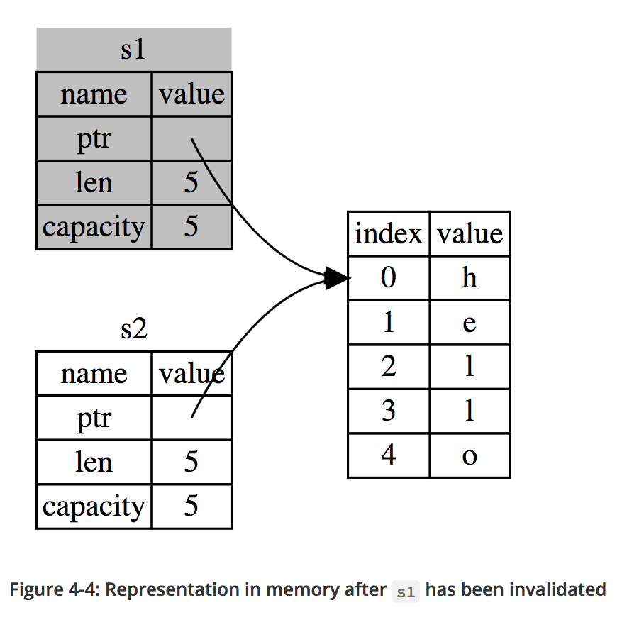

- `cargo check` makes sure your code compiles
    * Often faster
- `cargo run` compiles and runs

- Variables are immutable by default

- `io::Result` types are `enumerations`
    * The `Ok` variant indicates the operation was successful
    * The `Err` variant means that the operation failed, and the `Err` contains information about how or why the operation failed

- `Cargo.lock` is used to ensure reproducible builds

#### Identifiers

##### Raw Identifiers

- Sometimes oyu may need to use a name that's a keyword for another purpose
- Maybe you need to call a function named `match` that is coming from a C library where `match is not a keyword`
- You need a `raw identifier` for this

##### The Tuple Type

- General way of grouping together some number of other values of a variety of types into one compound type
- Fixed length

##### The Array Type

- All elements must have same type
- Have a fixed length
- Useful when you want your data allocated on the stack rather than the heap

#### Functions

- Snake case -> `snake_case` for both variable names and functin names

##### Function Bodies Contain Statements and Expressions

- Statements are instructions that perform some action and do not return a value
- Expressions evaluate to a resulting value

- Expressions do not include ending semicolons
- If you add a semicolon to the end of an expression, you turn it into a statement, which will then not return a value

##### Functions with Return Values

- Functions can return values to the code that calls them
- Don't name return values, but declare their type after an `->`

#### Ownership

- Memory safe guarantees w/o garbage collector

##### Stack and Heap

- In systems programming language like Rust, whether a value is on the stack or the heap has more of an effect on how the language behaves and why you have to make certain decisions

- Both stack and heap are parts of memory that are available to your code to use at runtime
- Stack stores values iin the order it gets them and removes the values in opposite order
- *Last in, first out*
- Adding data is called *pushing onto the stack*
- Removing data is called *popping off the stack*

- Stack is fast because of the way it accesses the data
- All data on the stack must take up a known, fixed size

- Data with a size unknown at compile time or a size that might change can be stored on the heap instead
- Heap is less organized: when you put data on theheap, you ask for some amount of space
- The OS finds an empty spot somewhere in the heap that is big enough, makr sit as being in use, and returns a `pointer` (which is the addresss of that location)
- This process is called `allocating on the heap`, sometimes just called `allocating`

- Because the pointer is a known, fixed size, you can store the pointer on the stack
- But when you want the actual data, you have to follow the pointer

- Accessing data in the heap is slower than accessing data on the stack because you have to follow a pointer to get there

- A processor can do its job better if it works on data that's close to other data (as it is on the stack) rather than farther away (as it can be on the heap)
- Allocating a large amount of space on the heap can also take time

- When your code calls a function, the values passed into the function (including potentially pointers to data on the heap) and the function's local variables get pushed onto the stack
- When the function is over, those values get popped off the stack

- Keeping track of what parts of code are using what data on the heap, minimizing the amount of duplicate data on the heap, and cleaning up unused data on the heap so you don't run out of space are all problems that `ownership addresses`

##### Ownership Rules

- Each value in Rust has a variable that's called its `owner`
- There can only be one owner at a time
- When the owner goes out of scope, the value will be dropped

##### Variable scope

```

#![allow(unused_variables)]
fn main() {
{                      // s is not valid here, it’s not yet declared
    let s = "hello";   // s is valid from this point forward

    // do stuff with s
}                      // this scope is now over, and s is no longer valid
}
```

##### The String Type

- Don't always know the size of a string
- User input can vary for example

```
let mut s = String::from("hello");

s.push_str(", world!"); // push_str() appends a literal to a String

println!("{}", s); // This will print `hello, world!`
```

- Strings like this are mutable but string literals are not
- They deal with memory differently

##### Memory and Allocation

- With a string literal, we know the contents at compile time
- This is why string literals are fast and efficient

- With the `String` tpye, in order to support a mutable, growable piece of text, we need to allocate an amount of memory on the head, unknown at compile time

- The memory must be requested from the OS at runtime
- We need a way of returning this memory to the OS when we're done with our `String`

- The first thing is done for us with `String::from`
- The second part is different
- In languages with a `garbage collectro`, the GC keeps track and cleans up memory that isn't being used anymore, and we don't need to think about it

- W/o a GC, it's our responsibility to identify when memory is no longer being used and call code to explicitly return it, just as we did to requeset it
- Doing this correctly has historically been a difficult problem
- Need to pair exactly one `allocate` with exactly one `free`

- Rust takes a different path
- There is a natural point at which we can return the memory our `String` needs to the operating system, when `s` goes out of scope
- When it goes out of scope, Rust calls a special function for us
- This function is called `drop`, and it's where the author of `String` can put the code to return the memory
- Rust calls `drop` automatically at the closign curly bracket

###### Ways Variables and Data Interact: Move

```
fn main() {
    let x = 5;
    let y = x;
}
```

- These two integers are simple values with a known, fixed size, and these two `5` values are pushed onto the stack

- With `String` version

```
let s1 = String::from("hello");
let s2 = s1;
```

- A `String` is made up of 3 parts
    * A pointer to the memory that holds the contents of the string
    * A length
    * And a capacity
- This group is stored on the stack
- On the right is the memory on the heap that holds the contents



- The length is how much memory, in bytes, the contents of the `String` is currently using
- The capacity is the total amunt of memory, in bytes, that the `String` has received from the operating system

- When we assign `s1` to `s2`, the `String` data is copied
    * The copy, the length, and the capacity
- We do not copy the data on the heap that the pointer refers to



- Rust automatically calls `drop` function and cleans up the heap memory for that variable
- But the above figure shows both data pointers pointing to the same memory
- This is a problem, when `s2` and `s1` go out of scope, they both try to free the same memory
- This is known as a `double free` error

- Instead of trying to copy the allocated memory, Rust considers `s1` to no longer be valid and therefore Rust doesn't need to free anything when `s1` goes out of scope

- Concept of copying pointer, length, and capacity w/o copying the data sounds like making a shallow copy
- But because Rust also invalidates the first variable, instead of being called a shallow copy, it's known as a move
- We would say that `s1` was moved into `s2`



###### Ways Variables and Data Interact: Clone

- If we do want to deeply copy the heap data of the `String`, not just the stack data, we can  use the common method called `clone`

```
let s1 = String::from("hello");
let s2 = s1.clone();

println!("s1 = {}, s2 = {}", s1, s2);
```

###### Stack-Only Data: Copy

```
let x = 5;
let y = x;

println!("x = {}, y = {}", x, y);
```

- We don't have a call to `clone`, but `x` is still valid and wasn't moved into `y`

- The reason is because types like integers have known size at compile time and are stored entirely on the stack
- There's no difference between deep and shallow copying here 

##### Ownership and Functions

```
fn main() {
    let s = String::from("hello");  // s comes into scope

    takes_ownership(s);             // s's value moves into the function...
                                    // ... and so is no longer valid here

    let x = 5;                      // x comes into scope

    makes_copy(x);                  // x would move into the function,
                                    // but i32 is Copy, so it’s okay to still
                                    // use x afterward

} // Here, x goes out of scope, then s. But because s's value was moved, nothing
  // special happens.

fn takes_ownership(some_string: String) { // some_string comes into scope
    println!("{}", some_string);
} // Here, some_string goes out of scope and `drop` is called. The backing
  // memory is freed.

fn makes_copy(some_integer: i32) { // some_integer comes into scope
    println!("{}", some_integer);
} // Here, some_integer goes out of scope. Nothing special happens.
```

- If we tried to use `s` after the call to `take_ownership`, Rust would throw a compile-time error

##### Return Values and Scope

```
fn main() {
    let s1 = gives_ownership();         // gives_ownership moves its return
                                        // value into s1

    let s2 = String::from("hello");     // s2 comes into scope

    let s3 = takes_and_gives_back(s2);  // s2 is moved into
                                        // takes_and_gives_back, which also
                                        // moves its return value into s3
} // Here, s3 goes out of scope and is dropped. s2 goes out of scope but was
  // moved, so nothing happens. s1 goes out of scope and is dropped.

fn gives_ownership() -> String {             // gives_ownership will move its
                                             // return value into the function
                                             // that calls it

    let some_string = String::from("hello"); // some_string comes into scope

    some_string                              // some_string is returned and
                                             // moves out to the calling
                                             // function
}

// takes_and_gives_back will take a String and return one
fn takes_and_gives_back(a_string: String) -> String { // a_string comes into
                                                      // scope

    a_string  // a_string is returned and moves out to the calling function
}
```

- Multiple return values as a tuple

```
fn main() {
    let s1 = String::from("hello");

    let (s2, len) = calculate_length(s1);

    println!("The length of '{}' is {}.", s2, len);
}

fn calculate_length(s: String) -> (String, usize) {
    let length = s.len(); // len() returns the length of a String

    (s, length)
}
```

##### References and Borrowing

- Define and use a `calculate_length` function that has a reference to an object as a parameter instead of taking ownership of the value

```
fn main() {
    let s1 = String::from("hello");

    let len = calculate_length(&s1);

    println!("The length of '{}' is {}.", s1, len);
}

fn calculate_length(s: &String) -> usize {
    s.len()
}
```

- Ampersands are *references*
- Having references as function parameters is called `borrowing`

- What happens if we try to modify something we're borrowing?

```
fn main() {
    let s = String::from("hello");

    change(&s);
}

fn change(some_string: &String) {
    some_string.push_str(", world");
}
```

- By defaylt, we're not allowed to modify something wehave a reference to
- We can fix this by doing

```
fn main() {
    let mut s = String::from("hello");

    change(&mut s);
}

fn change(some_string: &mut String) {
    some_string.push_str(", world");
}
```

- You can only have one mutable reference to a particular piece of data in a particular scope

- This code will fail

```
let mut s = String::from("hello");

let r1 = &mut s;
let r2 = &mut s;

println!("{}, {}", r1, r2);
```

```
error[E0499]: cannot borrow `s` as mutable more than once at a time
 --> src/main.rs:5:10
  |
4 | let r1 = &mut s;
  |          ------ first mutable borrow occurs here
5 | let r2 = &mut s;
  |          ^^^^^^ second mutable borrow occurs here
6 | println!("{}, {}", r1, r2);
  |                    -- borrow later used here
```

- Benefit of this restriction is that Rust can prevent data races at compile time
- A data race can happen when these three behaviors occur
    * Two or more pointers access the same data at the same time
    * At least one of the pointers is being used to write to the data
    * There's no mechanism being used to synchronize access to the data

```
let mut s = String::from("hello");

{
    let r1 = &mut s;

} // r1 goes out of scope here, so we can make a new reference with no problems.

let r2 = &mut s;
```

```
let mut s = String::from("hello");

let r1 = &s; // no problem
let r2 = &s; // no problem
let r3 = &mut s; // BIG PROBLEM

println!("{}, {}, and {}", r1, r2, r3);
```

##### Dangling References

- In languages with pointers, it's easy to create a `dangling pointer`
- A pointer that references a location in memory that may have been given to someone else, by freeing some memory while preserving a pointer to that memory

```
fn main() {
    let reference_to_nothing = dangle();
}

fn dangle() -> &String { // dangle returns a reference to a String

    let s = String::from("hello"); // s is a new String

    &s // we return a reference to the String, s
} // Here, s goes out of scope, and is dropped. Its memory goes away.
  // Danger!
```

```
error[E0106]: missing lifetime specifier
 --> main.rs:5:16
  |
5 | fn dangle() -> &String {
  |                ^ expected lifetime parameter
  |
  = help: this function's return type contains a borrowed value, but there is
  no value for it to be borrowed from
  = help: consider giving it a 'static lifetime
```